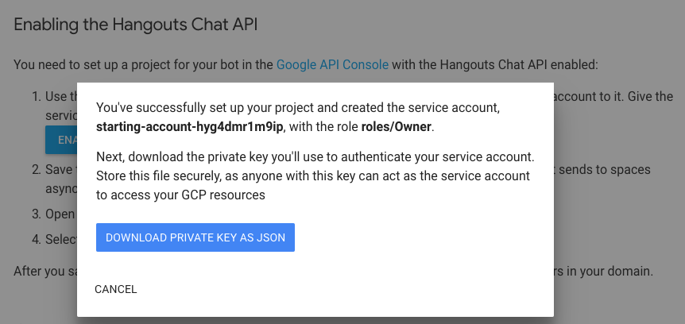

# Bots Webhook Sample - Google Hangouts Chat

This sample demonstrates integrating Oracle Bots with
[Google Hangouts Chat](https://gsuite.google.com/products/chat/) as an
[asynchronous bot](https://developers.google.com/hangouts/chat/how-tos/bots-develop#asyncresponse) by utilizing the webhook channel.

---

## Requirements

1. A running instance of Oracle Bots.
1. A business account with [gsuite.google.com](https://gsuite.google.com).

## Setup

Both Oracle Bots webhook channel and Google Hangouts Chat require **verified**
`HTTPS` endpoints for Webhook URIs. Depending on your environment, it may be necessary to use a tunnel such as [ngrok](https://ngrok.com/) during local development. Both the Bot _"Outgoing Webhook URI"_, and the Hangouts Chat _"Bot URL"_ will use the same domain.

> **TLDR:** Add a webhook channel to your Bot with `https://{host}/bot/webhook/receiver` as the _"Outgoing Webhook URI"_. Also configure Hangouts Chat API with `https://{host}/bot/channel/hangouts` as the _"Bot URL"_.

### Oracle Bot Webhook Channel

1. Navigate to the Bot Channels settings and add a new channel.
1. Select **Channel Type**: Webhook, and **Platform Version**: 1.1 (Conversation Model)
1. Enter `https://{host}/bot/webhook/receiver` for **Outgoing Webhook URI** where `{host}` is resolvable on the network.
1. Enter remaining details and enable the channel.

### Hangouts Chat

Once a GSuite account is establshed, the following must be completed
to integrate this sample with the Hangouts Chat application.

1. Login to the enterprise [admin console](https://admin.google.com/) for the GSuite domain.
1. Navigate to `Apps -> G Suite` and turn on Hangouts Chat 
1. Click on the **Hangouts Chat** item to configure with **Bot Options** enabled.
1. Use the Google app menu to open the Hangouts Chat application. 
1. Configure and publish a bot for Hangouts according to [the documentation](https://developers.google.com/hangouts/chat/how-tos/bots-publish).

1. Download service account JSON and save to `./google_service_account.json`

1. Open the [Google API Console](https://console.developers.google.com/)
1. Select the newly created project and search APIs for _"Hangouts"_ 
1. Select _"Hangouts Chat API"_ tile then click **Manage**.
1. Navigate to the _"Configuration"_ tab and enter bot details. The **Bot URL** field should be completed as `https://{host}/bot/channel/hangouts`, where `{host}` is replaced with a domain resolvable to this application. Be sure to take note of the **Verification Token**. 

## App Configuration

As mentioned above, it is required to download a GSuite service credential
file and save to `./google_service_account.json`. This sample also uses environment
variables for certain properties used in the webhook handlers. These properties
may be specified in an `.env` file, or set within the app environment directly.
Below is a list of the required environment variables
(also see [app.json](./config/app.json) for properties).

| Variable | Description |
|-|-|
| `HANGOUTS_BOT_VERIFICATION_TOKEN` | **Verification Token** received when the Hangouts Chat bot is configured and published  |
| `ORACLE_WEBHOOK_SECRET` | Secret key from Oracle Bot webhook channel configuration |
| `ORACLE_WEBHOOK_URL` | Absolute URL from Oracle Bot webhook channel configuration. **Note**: This url must be resolvable from the sample server. |

## Message Formats

It's not uncommon for a client to support only a subset of the features offered
by the Oracle Bot message API. Below are few items which will not render inside
the Google Hangouts Chat application. See [documentation](https://docs.oracle.com/en/cloud/paas/mobile-suite/use-chatbot/bot-channels.html#GUID-96CCA06D-0432-4F20-8CDD-E60161F46680) for details.

### Unsupported Messages

- Attachment messages from Bot will not display `video`, `audio`, or `file` type
attachments, but instead will show a link with icon and _"OPEN"_ text.
- Hangouts Chat does not send attachments to its Bots URL, and therefore cannot
be forwarded to the Oracle Bot as an attachment type messages.
- User's location cannot be sent by Hangouts Chat.

### Unsupported Actions

- `location` and `share` actions are not supported by the Hangouts Chat Client.